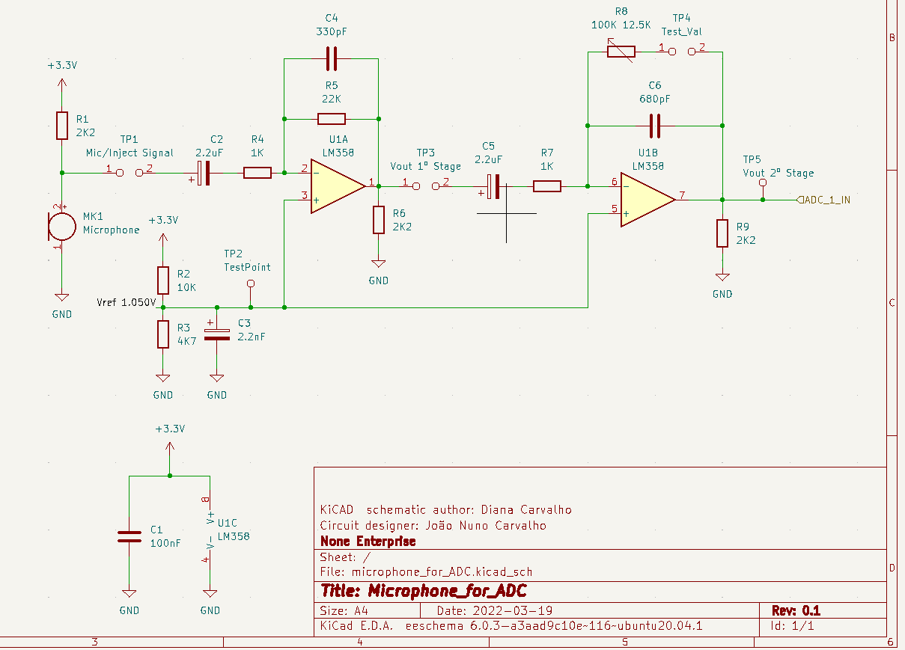
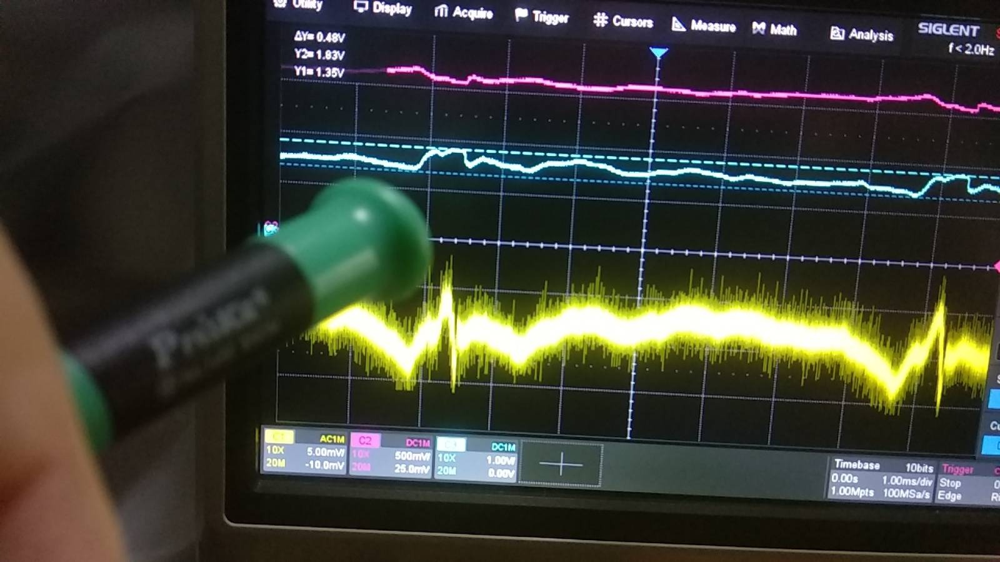
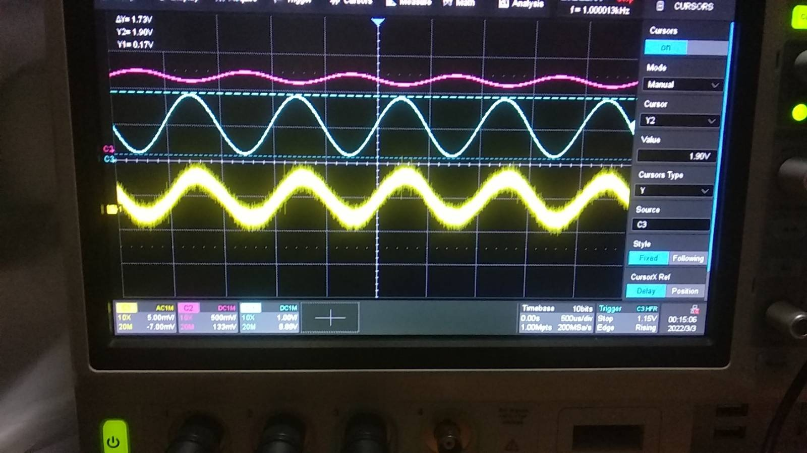
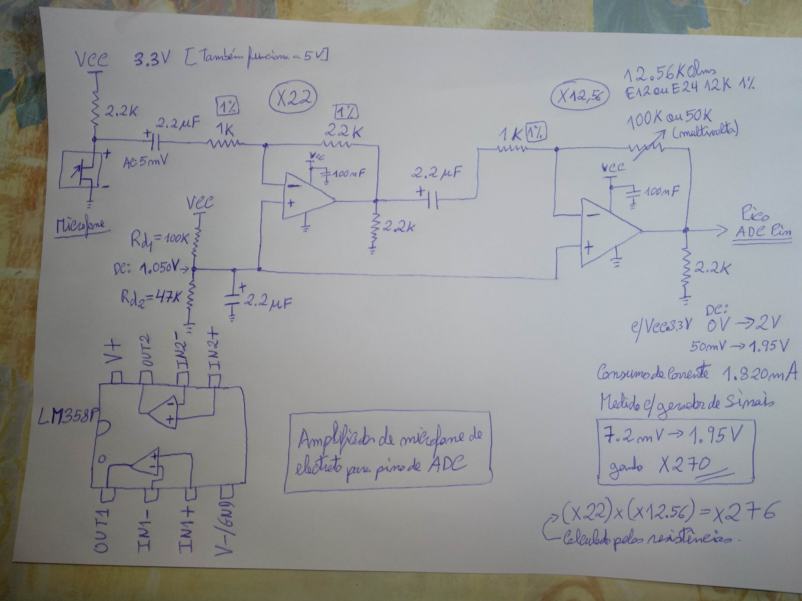
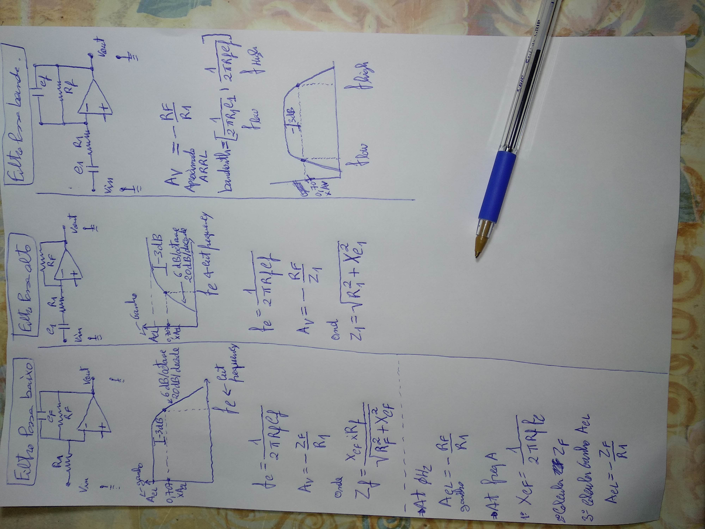
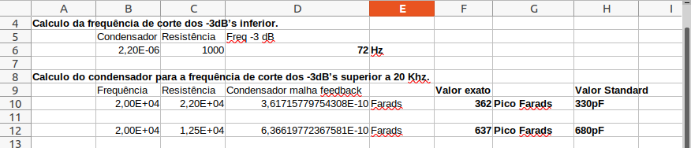
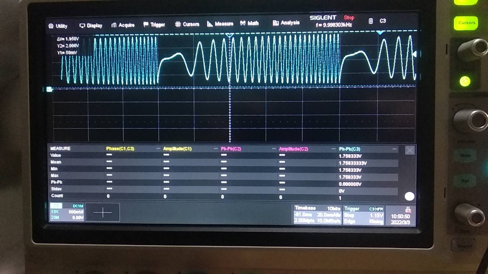
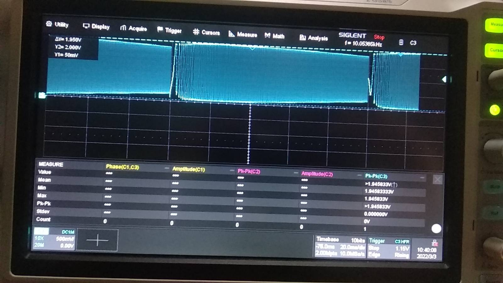
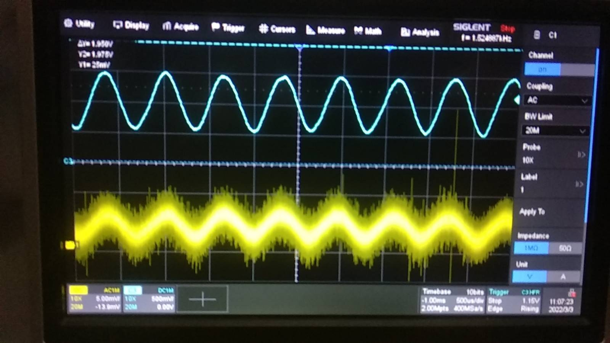

# Microphone Amplifier for Micro-Controller ADC with LM358
A simple and low cost design.

## Description
This is a low cost design, of a amplifier with a electret microphone capsule for the ADC of a 3.3V micro-controller. Using the OpAmp LM358P with 3 stages. 1º JFET stage, 2º and 3º OpAmp stages. The JFET transistor is inside the electret capsule. Overall gain x270 and bandwidth 70 Hz to 20 KHz. The LM358P is considered one of the cheapest and most common, "jelly bean" 2 OpAmp's integrated circuit.

## Specification
* Number od stages: 3
* Gain: x270
* Bandwidth: 70 Hz to 20 KHz
* Single supply voltage: 3.3 V
* Power Consumption: 2 mA
* Vin Max: 7.2 mV 
* Center VRef: 1.050 V
* Vout range: 50 mV to 1.95 V  

## Final schematic

The final schematic was drawn by my daughter, in the process of teaching her some of the technics used in electronics. In this case, how to draw a schematic with KiCAD. The KiCAD files are inside this project.  
 

  

## Design

The LM358 is a cheap OpAmp IC, but it has zero crossover issues. So we work only above zero volts. Because we are dealing with small current the LM358P appear to have glitch's that can be seen in the following oscilloscope image.  
 

  
 

This problem can be solved by adding a 2K2 load resister to the output of both OpAmp's. In this you can see the output of each stage of an injected sinusoidal signal of 7.2 mV. The lower trace is the injected signal, the upper trace is the output of the second stage and the middle trace is the output of the third stage, practically 2 V of signal amplitude.  
 

  

The preliminary pen drawing schematic was this one.  
 

  
 

The equations for the capacitor dimensioning in both 1º order Active Filter OpAmp design are the following.  
 

  
 

The calculations of the capacitors are the following.  
 

  
 

This is a Vout of a inject linear signal sweep from 1 Hz to 500 Hz with a amplitude of 7.2 mV.  
 

  
 

This is a Vout of a inject linear sweep signal from 1 Hz to 20 KHz with a amplitude of 7.2 mV.  
 

  
 

## Final test

This is the final test of a normal volume whistle and you can see the output without visible distortion. A whistle is a pure tone.  
 

  

## License
The license is Creative Commons license.

## Have fun!
Best regards,  
João Nuno Carvalho  
